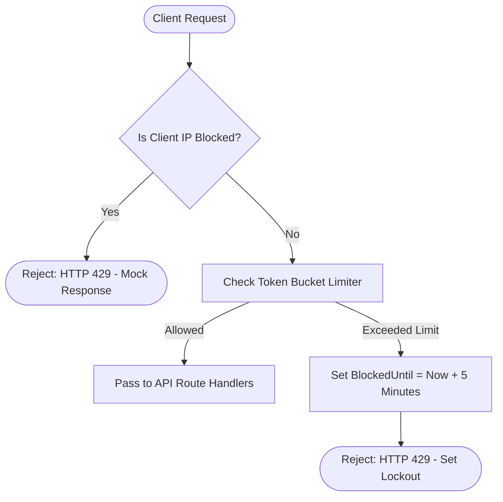
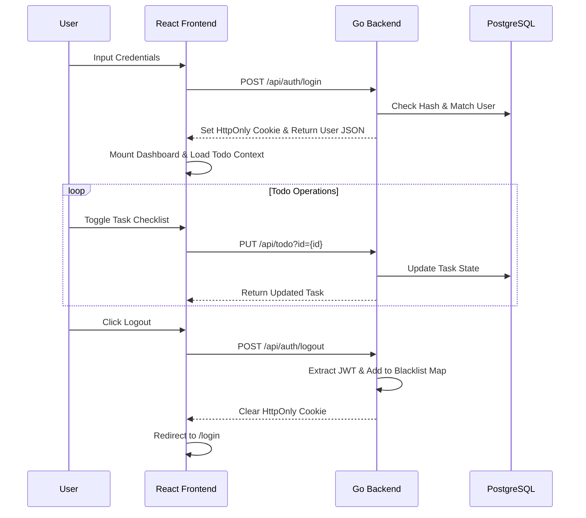
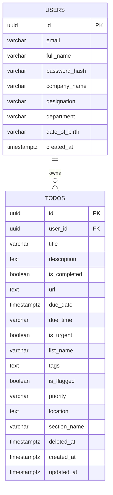

# 📝 TaskI: Secure Modular ToDo Application

A containerized, multi-tier ToDo application built for a technical assessment. The project pairs a concurrent Go REST API backend with a responsive React (Vite) frontend, implementing strict security controls and rate-limiting lockout protections suited for zero-trust environments.

[](https://golang.org/)
[](https://developer.mozilla.org/en-US/docs/Web/JavaScript)
[](https://react.dev/)
[](https://www.postgresql.org/)
[](https://www.docker.com/)
[](https://tailwindcss.com/)

## 📑 Table of Contents
- [📋 Project Overview](#-project-overview)
- [📸 Screenshots](#-screenshots)
- [🏗️ The Decision: Why React + Vite?](#️-the-decision-why-react--vite)
- [🏗️ The Approach: Modular Component Architecture](#️-the-approach-modular-component-architecture)
- [🛠️ Tech Stack](#️-tech-stack)
- [📐 Logic & Flow](#-logic--flow)
- [📂 Directory Tree](#-directory-tree)
- [🚀 Setup & Execution](#-setup--execution)
- [⚙️ Environment Variables](#️-environment-variables)
- [🧠 Retrospective](#-retrospective)
- [📈 Future Scalability](#-future-scalability)
- [🤝 Contributing](#-contributing)
- [📄 License](#-license)
- [👨‍💻 Author](#-author)

## 📋 Project Overview

**TaskI** is a secure task management application enabling users to organize daily workflows within customizable lists, collapsible sections, and strict security limits.

*   **The Core Loop**: Users authenticate securely, create tasks, assign priorities/due dates, group tasks into collapsible sections, and move items to a soft-delete Trash Bin.
*   **Decoupled State**: Custom React contexts handle data synchronization, maintaining separation between auth logic and task data stores.
*   **IP-Based Cooldowns**: Mutating APIs limit request bursts. Exceeding the rate limit triggers an immediate 5-minute block of the client's IP on both the backend and client-side.

## 📸 Screenshots

*(Screenshots will be added here to demonstrate the desktop and mobile interface)*

<!--
### 1. Main Dashboard View


---

### 2. Mobile Layout Responsive View

-->

## 🏗️ The Decision: Why React + Vite?

For this assessment, I decided to pair **Vite** with **React** to build a modern, high-speed single-page application.

### The Reasoning:
*   **Vite Development Speed**: Vite's ESM-based hot-module replacement drastically reduced compile times, keeping feedback loops fast.
*   **State Predictability**: Using React Contexts (`AuthContext` and `TodoContext`) allowed me to manage user credentials and task states without the overhead of heavy stores like Redux.
*   **Modular Rendering**: Breaking the interface down into custom elements ensures the DOM updates efficiently when checklist states toggle.

## 🏗️ The Approach: Modular Component Architecture

To maintain a clean codebase, the monolithic layout (~1600 lines) was refactored into a modular component architecture:

*   **Separation of Concerns**: Extracted separate modules for rendering tasks (`TaskCard.jsx`), editing tasks (`TaskModal.jsx`), configuring user data (`ProfileModal.jsx`), and prompting double-confirms (`ConfirmationModal.jsx`).
*   **Local State Isolation**: Form input states and sub-confirmation layers are kept local to their respective modals, preventing unnecessary re-renders of the main Dashboard workspace.

## 🛠️ Tech Stack

### Frontend
*   **Framework**: React (Vite)
*   **Styling**: Vanilla CSS (Liquid-glass animations, modern HSL-tailored colors, and micro-interactions)
*   **Icons**: Lucide React

### Backend
*   **Language**: Go (Golang)
*   **Architecture**: Domain-Driven Design (DDD) with routes, handlers, services, repositories, and models.
*   **Security**: IP rate-limiting, HttpOnly secure cookie-based JWT sessions, in-memory token revocation blacklist, and Origin CORS checks.
*   **Persistence**: PostgreSQL with schema versioning controlled by migrations.

## 📐 Logic & Flow

### 1. Rate-Limit Lockout Logic


### 2. User Journey (UX Flow)


### 3. Database Schema


## 📂 Directory Tree

```text
├── apps/
│   └── taski/                   # React (Vite) Frontend App
│       ├── public/              # Public Assets & Favicons
│       └── src/
│           ├── components/      # Modular UI Components & Modals
│           ├── contexts/        # Auth & Todo State Contexts
│           └── index.css        # Liquid glass CSS variables
├── database/                    # Database Schema & Migrations
│   └── migrations/              # SQL Migration scripts
├── server/                      # Go REST Backend Engine
│   ├── cmd/                     # Application entrypoint (main.go)
│   └── internal/                # Configuration, routes, handlers, and repositories
├── docker-compose.yml           # Container Orchestration
├── run.sh                       # Unified execution script
├── GETTING_STARTED.md           # Setup, running, and benchmarking guide
└── README.md                    
```

## 🚀 Setup & Execution

TaskI is fully containerized and easily deployed using Docker. Refer to **[GETTING_STARTED.md](GETTING_STARTED.md)** at the root directory for step-by-step setup, test scripts, and Siege stress-benchmarks.

## ⚙️ Environment Variables

The project uses a single `.env` file in the root directory:

| Variable | Description | Default / Example |
| :--- | :--- | :--- |
| `PORT` | Go REST API backend listener port | `8080` |
| `DB_HOST` | Database server address | `db` |
| `DB_PORT` | PostgreSQL port | `5432` |
| `DB_USER` | DB username | `todouser` |
| `DB_PASSWORD` | DB connection password | `todopassword` |
| `DB_NAME` | Relational database name | `tododb` |
| `DB_SSLMODE` | SSL security configuration | `disable` |
| `JWT_SECRET` | Secret key used to sign session cookies | `super_secure_secret_key` |
| `ENVIRONMENT` | Project execution context | `production` |
| `ALLOWED_ORIGINS` | CORS origin policies | `http://localhost:3000` |
## 🧠 Retrospective

### Pros
*   **Modular Cleanliness**: Refactoring `Dashboard.jsx` simplified the core layout, easing future enhancements.
*   **Strict Security**: In-memory token revocation and client-side lockout countdowns provide a bank-grade security user experience.
*   **No Dependency Bloat**: Bypassing heavy React libraries on styling ensures fast startup and execution.

### Cons
*   **In-Memory Storage**: Lockouts and token blacklists are currently stored in Go server RAM, which limits multi-container horizontal scaling.
*   **State Sync Overhead**: Toggling checklist items requires frequent back-and-forth database updates; caching layers would optimize this.

## 📈 Future Scalability (FinTech Production Enhancements)

While this architecture is robust for assessment purposes, deploying to a true zero-trust financial environment would require the following iterations:

1.  **Distributed JWT Revocation (Redis)**: Introduce a **Redis** instance to manage the Token Blacklist, ensuring immediate invalidation upon explicit user logout across multiple container nodes.
2.  **Distributed Lockout Cache (Redis)**: Move the client IP blacklist tracking map from Go RAM to Redis to share rate limits across multiple horizontal server containers.
3.  **Advanced CSRF Mitigations**: Supplement the `SameSite=Strict` cookie policies with an explicit Synchronizer Token Pattern (Anti-CSRF Tokens) for mutating requests.
4.  **Field-Level Encryption**: Enforce AES-256 encryption for task description bodies and user metadata before database writes.

## 🤝 Contributing
We welcome contributions! Here's how you can help:
1. **Fork** the repository
2. **Create a feature branch** (`git checkout -b feature/amazing-feature`)
3. **Make your changes**
4. **Test thoroughly** - Ensure existing functionality still works
5. **Commit your changes** (`git commit -m 'Add amazing feature'`)
6. **Push to the branch** (`git push origin feature/amazing-feature`)
7. **Open a Pull Request**

## 📄 License
This project is licensed under the MIT License - see the [LICENSE.md](LICENSE.md) file for details.

## 👨‍💻 Author
**Sayed Ahmed Husain**
- **Email**: [sayedahmed97.sad@gmail.com](mailto:sayedahmed97.sad@gmail.com)
- **GitHub**: [sahmedhusain](https://github.com/sahmedhusain)
