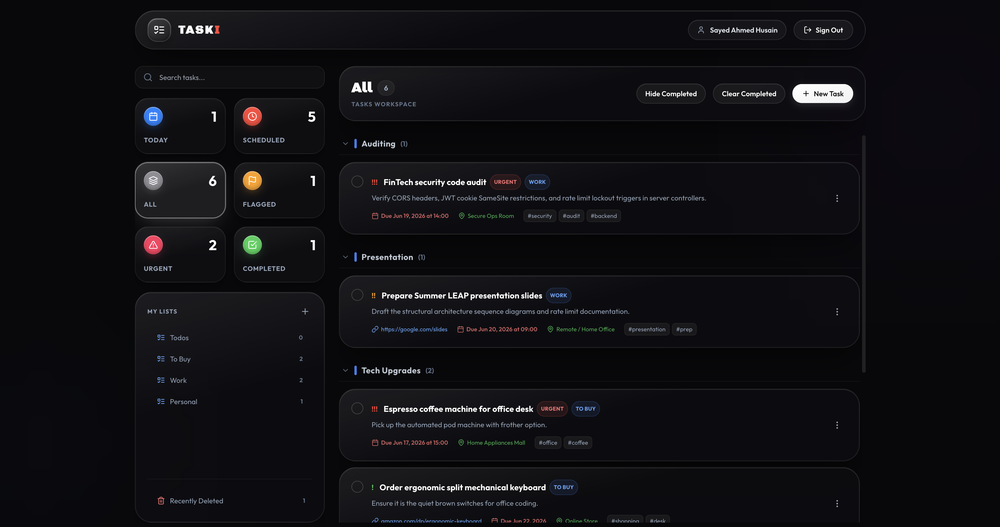
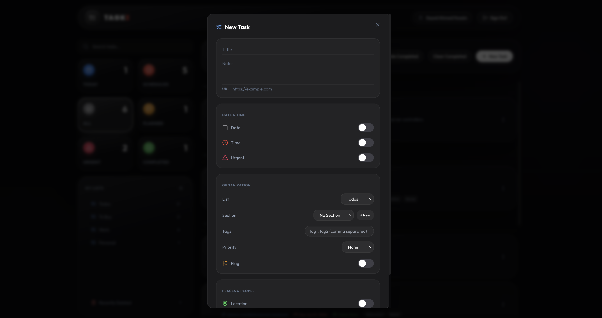
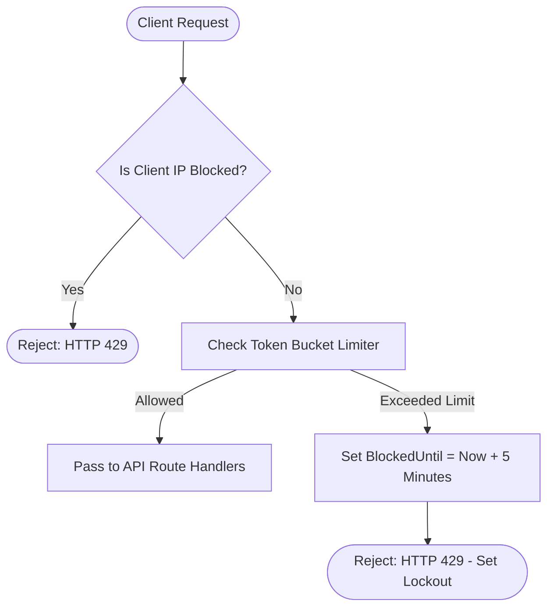
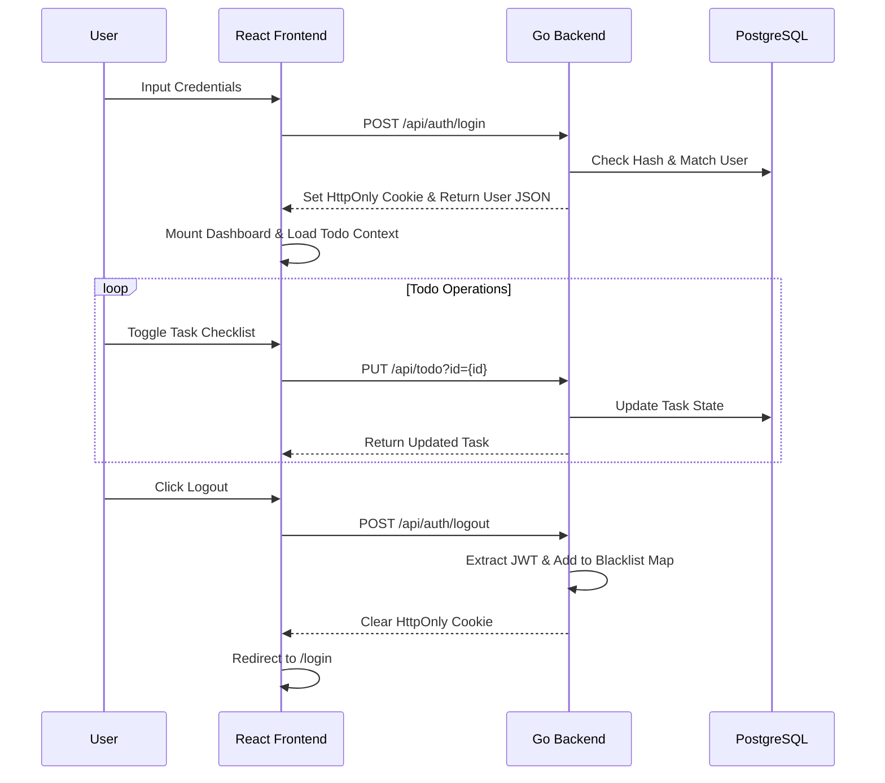
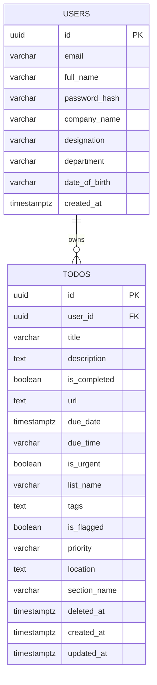

# 📝 TaskI: Secure ToDo Application

A containerized ToDo application featuring a concurrent Go REST API backend and a responsive React frontend. The application is built with security in mind, featuring rate-limiting, temporary IP-based lockouts, and stateful JWT revocation on logout.

[](https://golang.org/)
[](https://developer.mozilla.org/en-US/docs/Web/JavaScript)
[](https://react.dev/)
[](https://www.postgresql.org/)
[](https://www.docker.com/)
[](https://tailwindcss.com/)

## 📑 Table of Contents
- [📋 Project Overview](#-project-overview)
- [📸 Screenshots](#-screenshots)
- [🏗️ Architectural Decisions](#️-architectural-decisions)
- [🛠️ Tech Stack](#️-tech-stack)
- [📐 Logic & Flow](#-logic--flow)
- [📂 Directory Tree](#-directory-tree)
- [🚀 Setup & Execution](#-setup--execution)
- [⚙️ Environment Variables](#️-environment-variables)
- [🧠 Reflections & Limitations](#-reflections--limitations)
- [📈 Future Improvements](#-future-improvements)
- [🤝 Contributing](#-contributing)
- [📄 License](#-license)
- [👨‍💻 Author](#-author)

---

## 📋 Project Overview

**TaskI** is a task manager that allows users to organize their daily tasks inside customizable lists, collapsible sections, due dates, priorities, and a soft-delete Trash Bin.

*   **Core Workflow**: Users register and log in securely, create tasks with optional metadata (links, locations, flags, priority levels), group them into collapsible sections, and move completed or discarded items to a Trash Bin.
*   **State Management**: React Contexts manage authentication state and todo items independently.
*   **IP-Based Lockout**: Mutating API endpoints are rate-limited. Exceeding the rate limit triggers an immediate 5-minute IP block on both the backend and client-side to prevent request abuse.

---

## 📸 Screenshots

### 1. Main Dashboard View


---

### 2. Add New Task Modal View


---

## 🏗️ Architectural Decisions

### Why React + Vite?
*   **Fast Development**: Vite's ESM-based hot-reloading makes the development feedback loop extremely fast.
*   **State Predictability**: React Contexts (`AuthContext` and `TodoContext`) manage authentication and task states cleanly without the boilerplate of Redux.

### Modular Component Architecture
To keep the codebase maintainable, the monolithic dashboard UI was refactored into modular sub-components:
*   **Dedicated Modals & Cards**: Split components into dedicated files: [TaskCard.jsx](file:///Users/sayed/Desktop/GitHub/todo-app/apps/taski/src/components/TaskCard.jsx) for rendering lists, [TaskModal.jsx](file:///Users/sayed/Desktop/GitHub/todo-app/apps/taski/src/components/TaskModal.jsx) for forms, [ProfileModal.jsx](file:///Users/sayed/Desktop/GitHub/todo-app/apps/taski/src/components/ProfileModal.jsx) for profiles, and [ConfirmationModal.jsx](file:///Users/sayed/Desktop/GitHub/todo-app/apps/taski/src/components/ConfirmationModal.jsx) for action prompts.
*   **Isolated State**: Input fields, forms, and validation states are kept local to their respective modals, preventing unnecessary re-renders of the main Dashboard workspace.

---

## 🛠️ Tech Stack

### Frontend
*   **Framework**: React (Vite)
*   **Styling**: Tailwind CSS (with custom Glassmorphic styling and transition animations)
*   **Icons**: Lucide React

### Backend
*   **Language**: Go (Golang)
*   **Architecture**: Domain-Driven Design (DDD) with routes, handlers, services, repositories, and models.
*   **Security**: IP-based rate-limiting, HttpOnly secure session cookies, token blacklist for immediate revocation, and Origin CORS checks.
*   **Database**: PostgreSQL with schema versioning managed via migrations.

---

## 📐 Logic & Flow

### 1. Rate-Limit Lockout Logic


### 2. User Journey (UX Flow)


### 3. Database Schema


---

## 📂 Directory Tree

```text
├── apps/
│   └── taski/                   # React (Vite) Frontend App
│       ├── public/              # Public Assets & Favicons
│       └── src/
│           ├── components/      # Modular UI Components & Modals
│           ├── contexts/        # Auth & Todo State Contexts
│           └── index.css        # Tailwind config & custom variables
├── database/                    # Database Schema & Migrations
│   └── migrations/              # SQL Migration scripts
├── server/                      # Go REST Backend Engine
│   ├── cmd/                     # Application entrypoint (main.go)
│   └── internal/                # Configuration, routes, handlers, and repositories
├── docker-compose.yml           # Container Orchestration
├── run.sh                       # Unified execution script
├── GETTING_STARTED.md           # Setup, running, and benchmarking guide
└── README.md                    
```

---

## 🚀 Setup & Execution

TaskI is containerized and easily deployed using Docker. Refer to **[GETTING_STARTED.md](GETTING_STARTED.md)** at the root directory for step-by-step setup, test scripts, and Siege stress-benchmarks.

---

## ⚙️ Environment Variables

The project uses a single `.env` file in the root directory (copy `.env.example` to get started):

| Variable | Description | Default / Example |
| :--- | :--- | :--- |
| `PORT` | Go REST API backend listener port | `8080` |
| `ENVIRONMENT` | Project execution context | `production` |
| `DB_HOST` | Database server address | `db` |
| `DB_PORT` | PostgreSQL port | `5432` |
| `DB_USER` | DB username | `postgres` |
| `DB_PASSWORD` | DB connection password | `postgres` |
| `DB_NAME` | Relational database name | `todo` |
| `DB_SSLMODE` | SSL security configuration | `disable` |
| `JWT_SECRET` | Secret key used to sign session cookies | **No safe default** — must be set to a unique, high-entropy value (`openssl rand -base64 32`). The backend refuses to start in production with the default or a short value. |
| `CORS_ALLOWED_ORIGINS` | Comma-separated list of allowed CORS origins | `http://localhost:3000,http://localhost:5173` |
| `PGADMIN_EMAIL` | Login email for the local pgAdmin UI (bound to `127.0.0.1` only) | `admin@taski.com` |
| `PGADMIN_PASSWORD` | Login password for the local pgAdmin UI | `admin` |

---

## 🧠 Reflections & Limitations

*   **Modular Layout**: Breaking down the monolithic dashboard file made the codebase much easier to read and extend.
*   **Simple CSS & Tailwind**: Combining Tailwind utility classes with custom glassmorphism styles in `index.css` kept styling fast and lightweight.
*   **In-Memory Storage**: Lockouts and JWT blacklists are currently stored in Go server memory, which is appropriate for a single container but would lose state upon container restarts.

---

## 📈 Future Improvements

To move this architecture toward a production-grade scaling environment, we would look to implement the following changes:

1.  **Distributed State (Redis)**: Move the Token Blacklist and client IP rate-limit tracking map from Go server RAM into a shared Redis instance to maintain state across multiple container instances.
2.  **Advanced CSRF Mitigations**: Supplement `SameSite=Strict` cookie policies with an explicit Synchronizer Token Pattern (Anti-CSRF Tokens) for mutating requests.
3.  **Field-Level Encryption**: Enforce AES-256 encryption for task description bodies and user metadata before database writes.

---

## 🤝 Contributing
We welcome contributions! Here's how you can help:
1. **Fork** the repository
2. **Create a feature branch** (`git checkout -b feature/amazing-feature`)
3. **Make your changes**
4. **Test thoroughly** - Ensure existing functionality still works
5. **Commit your changes** (`git commit -m 'Add amazing feature'`)
6. **Push to the branch** (`git push origin feature/amazing-feature`)
7. **Open a Pull Request**

---

## 📄 License
This project is licensed under the MIT License - see the [LICENSE.md](LICENSE.md) file for details.

---

## 👨‍💻 Author
**Sayed Ahmed Husain**
- **Email**: [sayedahmed97.sad@gmail.com](mailto:sayedahmed97.sad@gmail.com)
- **GitHub**: [sahmedhusain](https://github.com/sahmedhusain)
