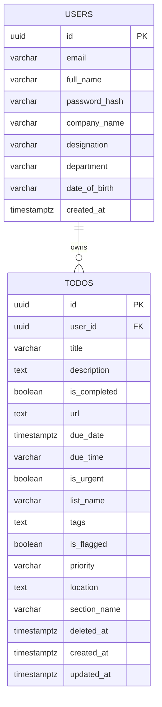

# 🗄️ Relational Database Schema & Migrations

TaskI uses **PostgreSQL** for data persistence. Schema versioning is managed via explicit, version-controlled SQL migration files, applied via `run.sh` (or `docker compose exec db psql ... < migration.sql`) rather than an implicit ORM auto-migrate step or an automatic container-init script - this keeps every schema change auditable and intentional.

---

## 🏛️ Schema Structure



---

## 📂 Migrations

Migrations are located in `database/migrations/` and executed in order:
*   `000001_init.up.sql` / `down.sql`: Creates initial tables, UUID extension, indices, and base user/todo structures.
*   `000002_add_reminder_features.up.sql` / `down.sql`: Introduces categories, urgency flags, tags, locations, and soft-delete support (`deleted_at`).
*   `000003_add_user_profile_features.up.sql` / `down.sql`: Appends corporate metadata columns (`company_name`, `designation`, `department`, `date_of_birth`) to the users table.

---

## 🐳 Container Image

The `db` service builds from `database/Dockerfile` (a custom image based on `postgres:16-alpine`), rather than running the upstream image unmodified. It bakes in fintech-grade runtime defaults the bare image doesn't set on its own:
*   **Defensive timeouts** (`statement_timeout`, `idle_in_transaction_session_timeout`, `lock_timeout`) so a runaway query or an abandoned open transaction can't hold locks or exhaust connections indefinitely.
*   **Audit-friendly logging** (`log_connections`, `log_disconnections`, `log_statement=ddl`) since this service is the system of record for user credentials and task data.

No host port is exposed for `db` in `docker-compose.yml` - it's reachable only from other containers on the internal Docker network.

---

## 📈 Performance Optimizations & Indexes

PostgreSQL is configured inside `docker-compose.yml` with the following optimizations:
*   `idx_users_email_lower` on `LOWER(email)`: Speeds up user credentials checks and ensures case-insensitive unique email constraints.
*   `idx_todos_user_id` on `todos(user_id)`: Speeds up task retrieval queries.
*   `idx_todos_deleted_at` on `todos(deleted_at)`: Optimizes queries filtering out deleted tasks (Active Workspace vs. Trash Bin).

---

## 💡 Example SQL Queries

Here is a list of SQL queries executed by the backend repository:

### 1. User Account Operations

*   **Create User**:
    ```sql
    INSERT INTO users (id, email, full_name, password_hash, created_at)
    VALUES ('uuid-here', 'user@domain.com', 'John Doe', '$2a$12$hash...', CURRENT_TIMESTAMP);
    ```

*   **Get User by Case-Insensitive Email**:
    ```sql
    SELECT id, email, full_name, password_hash, company_name, designation, department, date_of_birth, created_at
    FROM users
    WHERE LOWER(email) = LOWER('user@domain.com');
    ```

*   **Update Corporate Profile Metadata**:
    ```sql
    UPDATE users
    SET email = 'new-email@domain.com',
        full_name = 'John Doe Updated',
        company_name = 'Enterprise Corp',
        designation = 'Staff Engineer',
        department = 'Core Infrastructure',
        date_of_birth = '1990-05-12'
    WHERE id = 'user-uuid';
    ```

### 2. Task Operations

*   **Fetch Active Tasks**:
    ```sql
    SELECT id, user_id, title, description, is_completed, url, due_date, due_time, is_urgent, list_name, tags, is_flagged, priority, location, section_name, created_at, updated_at
    FROM todos
    WHERE user_id = 'user-uuid' AND deleted_at IS NULL
    ORDER BY created_at DESC;
    ```

*   **Fetch Deleted Tasks (Trash Bin)**:
    ```sql
    SELECT id, user_id, title, description, is_completed, url, due_date, due_time, is_urgent, list_name, tags, is_flagged, priority, location, section_name, deleted_at, created_at
    FROM todos
    WHERE user_id = 'user-uuid' AND deleted_at IS NOT NULL
    ORDER BY deleted_at DESC;
    ```

*   **Create Task**:
    ```sql
    INSERT INTO todos (id, user_id, title, description, is_completed, url, due_date, due_time, is_urgent, list_name, tags, is_flagged, priority, location, section_name, created_at, updated_at)
    VALUES ('todo-uuid', 'user-uuid', 'Audit Codebase', 'Description here', FALSE, 'https://github.com', '2026-06-20', '12:00', TRUE, 'Work', 'security,audit', TRUE, 'High', 'Room 101', 'Auditing', CURRENT_TIMESTAMP, CURRENT_TIMESTAMP);
    ```

*   **Update Task**:
    ```sql
    UPDATE todos
    SET title = 'Updated Title',
        description = 'Updated Description',
        is_completed = TRUE,
        url = 'https://new-url.com',
        due_date = '2026-06-25',
        due_time = '15:00',
        is_urgent = FALSE,
        list_name = 'Personal',
        tags = 'updated-tag',
        is_flagged = FALSE,
        priority = 'Medium',
        location = 'Remote',
        section_name = 'General',
        updated_at = CURRENT_TIMESTAMP
    WHERE id = 'todo-uuid' AND user_id = 'user-uuid';
    ```

*   **Soft Delete Task (Move to Trash)**:
    ```sql
    UPDATE todos
    SET deleted_at = CURRENT_TIMESTAMP
    WHERE id = 'todo-uuid' AND user_id = 'user-uuid';
    ```

*   **Restore Task from Trash**:
    ```sql
    UPDATE todos
    SET deleted_at = NULL
    WHERE id = 'todo-uuid' AND user_id = 'user-uuid';
    ```

*   **Hard Delete Task (Permanently Remove)**:
    ```sql
    DELETE FROM todos
    WHERE id = 'todo-uuid' AND user_id = 'user-uuid';
    ```

*   **Empty Trash Bin**:
    ```sql
    DELETE FROM todos
    WHERE user_id = 'user-uuid' AND deleted_at IS NOT NULL;
    ```

### 3. Statistics and Aggregations

*   **Count Tasks by List (Active vs Deleted)**:
    ```sql
    SELECT list_name, 
           COUNT(*) FILTER (WHERE deleted_at IS NULL) as active_count,
           COUNT(*) FILTER (WHERE deleted_at IS NOT NULL) as trashed_count
    FROM todos
    WHERE user_id = 'user-uuid'
    GROUP BY list_name;
    ```

*   **Count Task Counts by Section in a List**:
    ```sql
    SELECT COALESCE(NULLIF(section_name, ''), 'No Section') as section,
           COUNT(*) as count
    FROM todos
    WHERE user_id = 'user-uuid' AND list_name = 'Work' AND deleted_at IS NULL
    GROUP BY section_name;
    ```
