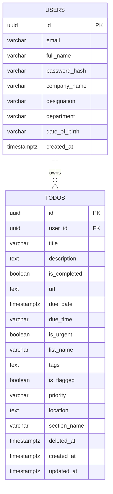

# 🗄️ Relational Database Schema & Migrations

TaskI utilizes **PostgreSQL** as its core persistent data store. Schema versioning is managed via SQL migration scripts executed automatically during service initialization.

---

## 🏛️ Schema Structure



---

## 📂 Migrations Directory

Database changes are recorded in sequentially ordered migration files:
*   `000001_init.up.sql` / `down.sql`: Creates initial tables, UUID extension, indices, and base user/todo structures.
*   `000002_add_reminder_features.up.sql` / `down.sql`: Introduces categories, urgency flags, tags, locations, and soft-delete support (`deleted_at`).
*   `000003_add_user_profile_features.up.sql` / `down.sql`: Appends corporate metadata columns (`company_name`, `designation`, `department`, `date_of_birth`) to the users table.

---

## 📈 Database Connection Parameters

PostgreSQL runs inside a Docker container defined in `docker-compose.yml`:
*   **Default Port**: `5432`
*   **Database Name**: `tododb`
*   **Indices**:
    *   `idx_users_email_lower` on `LOWER(email)`: Speeds up logins and case-insensitive unique checks.
    *   `idx_todos_user_id` on `todos(user_id)`: Accelerates todo fetches.

---

## 💡 Sample SQL Queries

Here are common SQL queries executed by the backend repository:

#### 1. Fetching Active (Non-Deleted) Tasks for a User:
```sql
SELECT id, user_id, title, description, is_completed, url, due_date, due_time, is_urgent, list_name, tags, is_flagged, priority, location, section_name, created_at, updated_at
FROM todos
WHERE user_id = $1 AND deleted_at IS NULL
ORDER BY created_at DESC;
```

#### 2. Soft-Deleting a Task (Moving to Trash):
```sql
UPDATE todos
SET deleted_at = CURRENT_TIMESTAMP
WHERE id = $1 AND user_id = $2;
```

#### 3. Restoring a Task from Trash:
```sql
UPDATE todos
SET deleted_at = NULL
WHERE id = $1 AND user_id = $2;
```

#### 4. Updating User Corporate Profile:
```sql
UPDATE users
SET email = $1, full_name = $2, company_name = $3, designation = $4, department = $5, date_of_birth = $6
WHERE id = $7;
```
